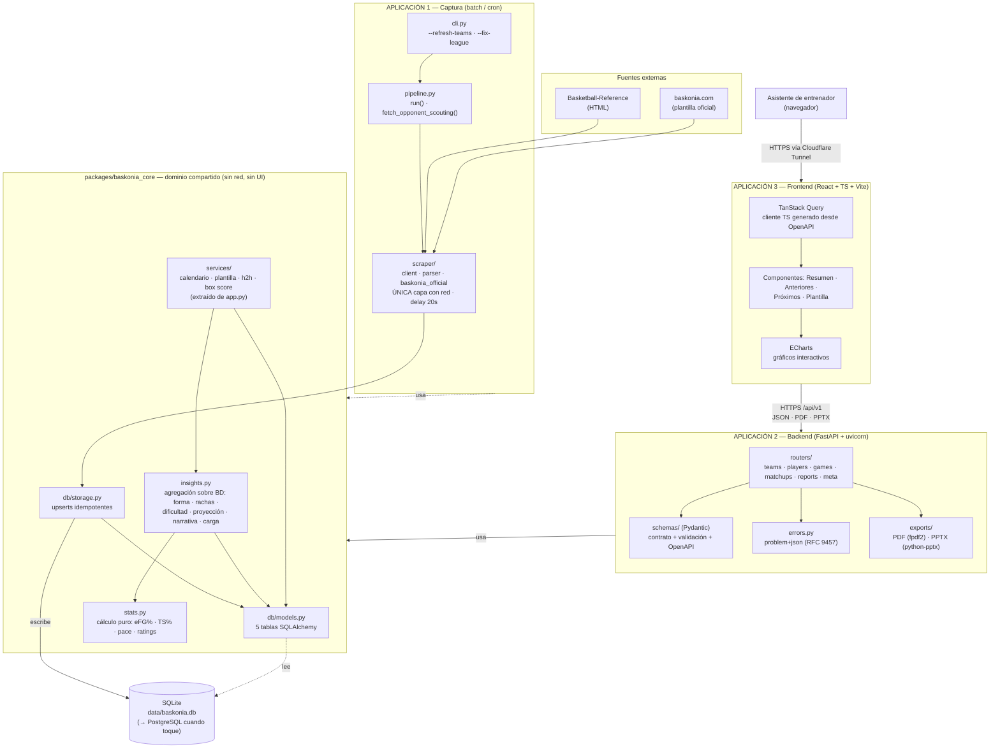

# Design: Arquitectura de la app final — separación pipeline / backend / frontend

## Contexto y objetivo

Hoy el proyecto es un PoC funcional con **una única capa de borde monolítica**: `app.py`
(51 KB, ~1.200 líneas) mezcla cuatro responsabilidades distintas en el mismo fichero:

| Responsabilidad | Evidencia en `app.py` | Dónde debería vivir |
|---|---|---|
| Acceso a BD | `get_session()`, `_team_games()`, `_team_stats_for_game()`, `past_games()`, `upcoming_games()`, `current_roster()`, `head_to_head_games()`, `games_in_window()` (líneas 117-427) | Capa de dominio/servicios |
| Preparación de datos | 10 funciones `*_df()` que devuelven `pandas.DataFrame` con **columnas ya traducidas y formateadas** (`"Fecha"`, `"Rival"`, `"Resultado": "88-79"`, `"-"` en vez de `None`) | API (datos crudos) + frontend (formato) |
| Renderizado | 9 funciones `render_*_tab()` / `render_*_section()` | Frontend |
| Exportación | `build_pdf_report()` (fpdf2), `build_roster_pptx()` (python-pptx) | Servicio de exportación del backend |

El resto de capas **ya está bien separado** y la regla de dependencia se respeta:
`scraper/` → `db/` → `stats.py`/`insights.py` → `app.py`/`report.py`/`main.py`. `insights.py`
expone 14 funciones públicas de agregación con contratos ya estables (dicts de tipos primitivos,
`Optional[...]` para "sin dato"), y `stats.py` es cálculo puro. **Esa lógica de negocio no se
reescribe: se reutiliza tal cual desde la nueva API.**

Objetivo de este documento: definir la arquitectura destino en la que

1. el **pipeline de captura** (`scraper/` + `main.py`) es una aplicación autónoma y desplegable
   por separado, con su propio ciclo de vida (batch/cron), y
2. la **explotación de datos** es una aplicación cliente/servidor: backend con API REST propia +
   frontend SPA, ambos consumiendo el mismo dominio compartido.

Este documento es **solo diseño**: no se escribe código de producción. Los fragmentos son
ilustrativos del contrato, no implementación.

---

## Alcance

**Entra:**

1. Diagrama de capas y de despliegue lógico de la arquitectura objetivo (Mermaid).
2. Elección justificada de stack: backend, estilo de API, frontend, librería de gráficos, BD.
3. Estructura de carpetas destino (monorepo con dominio compartido).
4. Contrato completo de la API REST: endpoints, métodos, parámetros, códigos de estado,
   payloads de ejemplo y modelo de error.
5. Reglas transversales: manejo de errores, logging, versionado, caché, testing.
6. Decisión sobre PostgreSQL (migrar ahora vs. después) con criterios de disparo.

**Fuera de alcance** (explícito):

- **Implementación**. El plan de ejecución incremental vive en
  [02_migration.md](02_migration.md); el despliegue, en [03_deplyment_design.md](03_deplyment_design.md).
- **Autenticación / multiusuario**. El PoC se sirve tras un túnel Cloudflare sin login (ver
  README §6.1). Se deja el *punto de enganche* diseñado (middleware + dependencia FastAPI), pero
  no se diseña el flujo de identidad.
- **Cambios de comportamiento del pipeline**. `main.py`, `scraper/`, `db/`, `stats.py` e
  `insights.py` mantienen exactamente su comportamiento actual; el diseño solo los **reubica**.
- **Cambios de esquema de datos**. Ninguna de las 5 tablas (`teams`, `players`, `games`,
  `boxscores`, `team_game_stats`) cambia. La API se construye sobre el esquema actual.
- **Disparar scraping desde la API**. Decisión explícita, ver "Frontera ingest ↔ API".
- **Nuevas funcionalidades de análisis**. La API expone exactamente lo que hoy consume la UI.

---

## Módulos y capas afectados

| Módulo actual | Destino | Tipo de cambio |
|---|---|---|
| `scraper/` | `apps/ingest/scraper/` | movido, sin cambios de lógica |
| `main.py` | `apps/ingest/pipeline.py` + `apps/ingest/cli.py` | movido; el `argparse` se separa de `run()` |
| `db/` (`models.py`, `storage.py`) | `packages/baskonia_core/db/` | movido; `_add_missing_columns()` se sustituye por Alembic |
| `config.py` | `packages/baskonia_core/config.py` | movido; se parte en `CoreSettings` / `IngestSettings` / `ApiSettings` |
| `stats.py` | `packages/baskonia_core/stats.py` | movido, **sin cambios** |
| `insights.py` | `packages/baskonia_core/insights.py` | movido, **sin cambios de firma** |
| `app.py` — helpers de BD (`_team_games`, `past_games`, `upcoming_games`, `games_in_window`, `current_roster`, `head_to_head_games`, `_rival_of`, `_result_label`, `_team_stats_for_game`) | `packages/baskonia_core/services/` | **extraído** (hoy es lógica de negocio atrapada en la UI) |
| `app.py` — funciones `*_df()` | eliminadas | su contenido se parte: agregación → servicios; formato → frontend |
| `app.py` — `render_*()` | `apps/web/` (React) | reescrito como componentes |
| `app.py` — `build_pdf_report`, `build_roster_pptx`, `_pdf_table`, `_PPT_*` | `apps/api/exports/` | movido, sin cambios de contenido |
| `report.py` (CLI de consulta) | `apps/ingest/report.py` | movido; sigue siendo herramienta de diagnóstico offline |
| `tests/` | `tests/` (raíz) + `tests/api/` nuevos | los 5 ficheros actuales se mantienen; solo cambian imports |

**Regla de dependencia destino** (estricta, verificable con un test de import):

```
apps/ingest/scraper  →  packages/baskonia_core/db
packages/baskonia_core/db  →  (nada del proyecto)
packages/baskonia_core/stats  →  (nada del proyecto)      # cálculo puro
packages/baskonia_core/insights  →  db, stats
packages/baskonia_core/services  →  db, stats, insights
apps/ingest  →  core (db, stats, config)   [única capa con red saliente]
apps/api     →  core (services, insights, stats, db)
apps/web     →  apps/api (solo por HTTP)
```

Prohibiciones que el test de arquitectura debe hacer cumplir:
`core/*` **nunca** importa `apps/*`; `apps/api` **nunca** importa `apps/ingest` (la API no scrapea);
`core/stats` **nunca** importa `db` (se mantiene puro, como hoy).

---

## Diseño

### 1. Arquitectura objetivo (diagrama Mermaid)



**Lectura del diagrama en una frase:** el pipeline escribe en la BD y se olvida; el backend lee de
la BD y publica JSON; el frontend solo habla HTTP. Los tres comparten un único paquete de dominio,
de modo que la lógica de negocio existe **una sola vez**.

### 2. Frontera ingest ↔ API: acoplamiento solo por la base de datos

Las dos aplicaciones se comunican **exclusivamente a través de la base de datos**. No hay llamadas
de la API al pipeline ni al revés.

**Decisión: la API no dispara scraping.** Motivos concretos, no genéricos:

- `config.REQUEST_DELAY = 20` segundos. Un scouting de un rival hace decenas de peticiones →
  minutos de espera. No cabe en un ciclo request/response HTTP.
- El pipeline **escribe** (upserts + backup previo de la BD en `_backup_database()`); la API es
  **solo lectura**. Mantener esa asimetría hace trivial el razonamiento sobre concurrencia y es
  precisamente lo que permite seguir con SQLite (ver §7).
- Un endpoint de scraping expuesto tras un túnel público sin autenticación es un vector para
  golpear a Basketball-Reference desde fuera.

**Consecuencia:** el pipeline se ejecuta por `cron`/`systemd timer` (ya es la recomendación del
README §6.1 "Notas"). La API **sí** expone en solo lectura el estado de frescura del dato, derivado
de lo ya persistido y sin cambiar el esquema:

```
GET /api/v1/meta/data-freshness
{
  "last_played_game_date": "2026-08-15",
  "games_total": 220,
  "games_played": 139,
  "boxscore_rows": 2841,
  "database_mtime": "2026-08-19T05:12:44Z"
}
```

Si más adelante se quiere lanzar el pipeline desde la UI, el diseño correcto es una **cola de
trabajos** (tabla `ingest_jobs` + worker), no una petición HTTP síncrona. Queda fuera de alcance.

### 3. Backend: FastAPI

| Candidato | Por qué **no** |
|---|---|
| Flask | Sin validación ni OpenAPI de serie; el contrato quedaría en documentación, no en código |
| Django + DRF | ORM propio: obligaría a reescribir `db/models.py` y con ello a tocar `storage.py`, `insights.py` y el pipeline. Viola la restricción 6 |
| Litestar | Técnicamente válido y comparable, pero ecosistema y material de referencia menores |

**FastAPI** gana por tres razones específicas de *este* proyecto:

1. **Reutiliza el dominio sin tocarlo.** `insights.py` ya devuelve `List[Dict[str, object]]` y
   `Dict[str, Optional[float]]` de tipos primitivos: serializan a JSON directamente. La API es una
   capa fina de validación + mapeo, no una reescritura.
2. **OpenAPI automático** → cliente TypeScript generado (`openapi-typescript` +
   `openapi-fetch`). El contrato deja de ser un documento que se desincroniza y pasa a ser un
   artefacto compilable: si el backend cambia un campo, el build del frontend falla.
3. **Pydantic como frontera explícita.** Hoy `app.py` mezcla dato y presentación
   (`"Resultado": "88-79"`, `"-"` para nulo, meses en español). Un schema Pydantic obliga a
   declarar tipo y nulabilidad de cada campo, y ahí muere esa mezcla.

Servidor: `uvicorn` con workers síncronos. **No se usa `async def` en los endpoints**: SQLAlchemy
está en modo síncrono y `insights.py` es CPU/IO-bound sobre SQLite; declarar `def` (no `async def`)
hace que FastAPI los ejecute en su threadpool, que es el comportamiento correcto aquí. Usar
`async def` con un ORM síncrono bloquearía el event loop — es el error clásico y se descarta por
diseño.

### 4. Estilo de API: REST, no GraphQL

Se evaluó GraphQL (Strawberry) y **se descarta**. Justificación por criterios del proyecto:

| Criterio | REST | GraphQL | Veredicto |
|---|---|---|---|
| Nº de consumidores | 1 (el dashboard) | ventaja solo con muchos clientes heterogéneos | REST |
| Forma del dato | `insights.py` devuelve **agregados ya cerrados** (dicts planos con 10-12 campos calculados). No hay grafo que recorrer ni sobre-fetching que evitar | el valor de GraphQL es la selección de campos en un grafo | REST |
| Coste de implementación | routers + schemas | schema, resolvers, y **dataloaders obligatorios** para no destrozar SQLite con N+1 | REST |
| Descargas binarias | `Response` con `Content-Type: application/pdf` | fuera del protocolo; hace falta un endpoint REST igualmente | REST |
| Caché | HTTP estándar (`ETag`, `Cache-Control`) sirve tal cual — clave porque el dato **solo cambia tras una ejecución del pipeline** | POST único: la caché HTTP no aplica sin capas extra | REST |
| Generación de tipos para el front | OpenAPI → TS | también disponible | empate |

El dato de este proyecto cambia unas pocas veces al día (cuando corre el cron) y se consume en
pantallas fijas. Es el caso canónico de REST + caché HTTP.

**Convenciones del contrato** (reglas duras, verificables en review):

1. **Prefijo y versión**: `/api/v1`. Un cambio incompatible abre `/api/v2`; añadir campos
   opcionales no lo es.
2. **JSON en `snake_case`**, igual que las claves que ya devuelve `insights.py` (`avg_net_rating`,
   `z_score_pts`). Cero capa de traducción entre dominio y contrato.
3. **La API no formatea.** Números como números (`0.5432`, no `"54,3 %"`), fechas **ISO-8601**
   (`"2026-01-15"`, no `"jueves, 15 de enero de 2026"`), y `null` para ausencia de dato — nunca
   `"-"`. Los helpers `format_date_es`, `_fmt`, `_fmt_pct` de `app.py` **no cruzan** al backend:
   su equivalente vive en el frontend. Nota de implementación: `Game.date` se guarda en formato BBR
   (`"Thu, Jan 15, 2026"`); la conversión a ISO es responsabilidad del mapper de la API.
4. **Filtros globales como query params**: `season` (año de inicio, p.ej. `2025`) y `league`
   (`acb` | `euroleague` | `supercopa`). Omitir el parámetro = sin filtrar en ese eje, exactamente
   la semántica actual de `None` en `insights.py`.
5. **Identificación de equipos por `slug`** (`vitoria`, `bilbao`), no por id numérico: el slug es
   estable, legible en la URL y ya es la clave única del modelo.
6. **Sin paginación** salvo en `/games` (`limit`/`offset`): el volumen máximo por equipo es de
   ~220 partidos y ~35 jugadores.
7. **Caché**: `Cache-Control: public, max-age=60` + `ETag` derivado del `mtime` de la BD. Un
   `If-None-Match` tras una respuesta previa devuelve `304`.

### 5. Contrato de la API

Todos los endpoints son `GET` (la API es de solo lectura). Base: `/api/v1`.

#### 5.1 Índice de endpoints

| # | Método y ruta | Origen en el código actual | Query params |
|---|---|---|---|
| 1 | `GET /health` | — | — |
| 2 | `GET /meta/data-freshness` | derivado de `games`/`boxscores` | — |
| 3 | `GET /teams` | `session.query(Team)` | — |
| 4 | `GET /teams/{slug}` | ídem + `config.TEAM_DISPLAY_NAMES` | — |
| 5 | `GET /teams/{slug}/filters` | `insights.list_seasons` + `list_leagues` + `current_season` | — |
| 6 | `GET /teams/{slug}/summary` | `insights.team_advanced_summary` | `season`, `league` |
| 7 | `GET /teams/{slug}/games` | `app.past_games` / `app.upcoming_games` / `_team_games` | `season`, `league`, `status`, `limit`, `offset` |
| 8 | `GET /teams/{slug}/roster` | `app.current_roster` + `_player_stats_row` | `season`, `league`, `last_n` |
| 9 | `GET /teams/{slug}/players/form` | `insights.player_recent_form` | `season`, `league`, `last_n` |
| 10 | `GET /teams/{slug}/players/streaks` | `insights.player_form_zscore` | `season`, `league`, `recent_n`, `min_season_games` |
| 11 | `GET /teams/{slug}/players/load` | `app.games_in_window` + `insights.player_load` | `window_days` |
| 12 | `GET /teams/{slug}/schedule-difficulty` | `insights.schedule_difficulty` | `season`, `league`, `next_n` |
| 13 | `GET /teams/{slug}/narrative` | `insights.scouting_narrative` | `season`, `league`, `recent_n` |
| 14 | `GET /teams/{slug}/matchups/{opponent_slug}/projection` | `insights.project_next_matchup` | `season`, `league` |
| 15 | `GET /teams/{slug}/matchups/{opponent_slug}/head-to-head` | `app.head_to_head_games` + `head_to_head_summary_df` | `season`, `league` |
| 16 | `GET /games/{game_id}/boxscore` | `app.boxscore_df` | `team_slug` (obligatorio) |
| 17 | `GET /teams/{slug}/reports/scouting.pdf` | `app.build_pdf_report` | `season`, `league`, `last_n` |
| 18 | `GET /teams/{slug}/reports/roster.pptx` | `app.build_roster_pptx` | `season`, `league`, `last_n` |
| 19 | `GET /admin/data-quality` | `insights.validate_data` | — |

Cobertura frente al requisito 2 del encargo: resumen de equipo (6), forma reciente por jugador (9),
partidos anteriores (7 con `status=played`), próximos enfrentamientos (7 con `status=upcoming` +
14), plantilla (8), rachas (10), dificultad de calendario (12), proyección de partido (14),
narrativa de scouting (13), carga de minutos (11). **10/10.**

#### 5.2 Payloads de ejemplo

**5 — Filtros disponibles** (lo que hoy pinta la cabecera de `app.main()`):

```http
GET /api/v1/teams/vitoria/filters
```
```json
{
  "seasons": [2026, 2025, 2024],
  "default_season": 2025,
  "leagues": [
    { "code": "acb",        "label": "ACB" },
    { "code": "euroleague", "label": "Euroliga" },
    { "code": "supercopa",  "label": "Supercopa" }
  ]
}
```
> `default_season` reproduce `insights.current_season()`: la temporada de hoy si ya tiene algún
> partido jugado, si no la más reciente con partidos. `leagues` sale de `Game.league` persistido
> (no de `config.LEAGUES`), tal y como ya hace `insights.list_leagues`.

**6 — Resumen del equipo:**

```http
GET /api/v1/teams/vitoria/summary?season=2025&league=euroleague
```
```json
{
  "team": { "slug": "vitoria", "name": "Baskonia", "league": "acb" },
  "filters": { "season": 2025, "season_label": "2025-26", "league": "euroleague" },
  "advanced": {
    "avg_pace": 74.8,
    "avg_off_rating": 112.4,
    "avg_def_rating": 108.9,
    "avg_net_rating": 3.5,
    "avg_efg_pct": 0.5312,
    "avg_ts_pct": 0.5687
  },
  "games_played": 38,
  "games_upcoming": 4
}
```
> Cualquier clave de `advanced` puede ser `null` — es la semántica exacta de
> `insights.team_advanced_summary`, que devuelve `None` cuando no hay ninguna fila con ese dato
> dentro del filtro. El frontend debe renderizar el hueco, no un `0`.

**7 — Partidos:**

```http
GET /api/v1/teams/vitoria/games?season=2025&league=acb&status=played&limit=5
```
```json
{
  "items": [
    {
      "id": 412,
      "date": "2026-05-18",
      "league": "acb",
      "is_home": true,
      "opponent": { "slug": "real-madrid", "name": "Real Madrid" },
      "team_score": 88,
      "opponent_score": 79,
      "result": "W",
      "notes": null,
      "advanced": { "pace": 72.1, "off_rating": 118.3, "def_rating": 106.2, "net_rating": 12.1 },
      "has_boxscore": true
    }
  ],
  "total": 101,
  "limit": 5,
  "offset": 0
}
```
> Diferencias deliberadas con `app._games_to_df()`: `result` es un enum (`"W"`/`"L"`/`null`), no la
> cadena `"88-79"`; `date` es ISO; los nulos son `null`, no `"-"`; y `advanced` es un objeto
> anidado en vez de cuatro columnas planas. `status` acepta `played` | `upcoming` | `all`.
> `has_boxscore` evita que el frontend pida un box score inexistente (hoy solo se descargan los
> de los últimos `config.LAST_N_GAMES` partidos y los enfrentamientos directos).

**9 — Forma reciente por jugador** (mapeo 1:1 con `insights.player_recent_form`):

```http
GET /api/v1/teams/vitoria/players/form?season=2025&league=euroleague&last_n=5
```
```json
{
  "last_n": 5,
  "items": [
    {
      "player_name": "Markus Howard",
      "games": 5,
      "avg_minutes": 27.4,
      "avg_pts": 19.6,
      "avg_pts_per36": 25.8,
      "avg_efg_pct": 0.5610,
      "avg_ts_pct": 0.6012,
      "avg_plus_minus": 4.2,
      "avg_turnovers": 1.8,
      "fg3a_rate": 0.6410,
      "ft_rate": 0.2870
    }
  ]
}
```

**10 — Rachas:**

```http
GET /api/v1/teams/vitoria/players/streaks?season=2025&recent_n=5&min_season_games=6
```
```json
{
  "season": 2025,
  "recent_n": 5,
  "min_season_games": 6,
  "items": [
    {
      "player_name": "Chima Moneke",
      "games_season": 31,
      "recent_avg_pts": 17.2, "season_avg_pts": 12.1, "season_std_pts": 4.3, "z_score_pts": 1.19,
      "recent_avg_ts_pct": 0.6420, "season_avg_ts_pct": 0.5810,
      "season_std_ts_pct": 0.0712, "z_score_ts": 0.86,
      "label": "hot"
    }
  ]
}
```
> `label` (`"hot"` | `"cold"` | `"neutral"`) se deriva en el backend con los umbrales ya definidos
> en `insights.ZSCORE_HOT_THRESHOLD` / `ZSCORE_COLD_THRESHOLD`, no se reinventa en el frontend:
> es una regla de negocio, no de presentación. `z_score_ts` puede ser `null` con `z_score_pts` no
> nulo (cobertura de `ts_pct` menor) — el contrato lo refleja y el frontend debe soportarlo.

**11 — Carga de minutos** (excepción documentada al filtro global):

```http
GET /api/v1/teams/vitoria/players/load?window_days=14
```
```json
{
  "window_days": 14,
  "games_in_window": 5,
  "note": "La carga física es transversal a temporada y competición: este endpoint ignora deliberadamente los filtros globales.",
  "items": [
    { "player_name": "Chima Moneke", "games": 5, "total_minutes": 148.5, "avg_minutes": 29.7 }
  ]
}
```
> Refleja la excepción ya documentada en la feature 001 (`insights.player_load` no recibe
> `season`/`league`). El endpoint **rechaza** `season`/`league` con `400` en vez de ignorarlos en
> silencio, para que la discrepancia sea visible.

**12 — Dificultad de calendario:**

```json
{
  "games_considered": 5,
  "opponents_scouted": 3,
  "avg_opponent_net_rating": 2.4,
  "league": "euroleague",
  "opponents": [
    { "opponent_name": "Panathinaikos", "date": "2026-09-30", "net_rating": 6.8 },
    { "opponent_name": "Baxi Manresa",  "date": "2026-10-04", "net_rating": null }
  ]
}
```
> `opponents_scouted` < `games_considered` es normal y esperado: solo los rivales ya scouteados
> tienen Net Rating. El frontend debe mostrar esa cobertura, no ocultarla.

**14 — Proyección de partido:**

```json
{
  "team": { "slug": "vitoria", "name": "Baskonia" },
  "opponent": { "slug": "bilbao", "name": "Bilbao Basket" },
  "season": 2025,
  "projection": {
    "expected_pace": 73.4,
    "team_expected_points": 84.2,
    "opponent_expected_points": 79.6,
    "expected_margin": 4.6
  }
}
```
> Si a alguno de los dos equipos le falta pace/ORtg/DRtg en esa temporada,
> `insights.project_next_matchup` devuelve `None` → la API responde **`200` con
> `"projection": null`**, no `404`. Motivo: el recurso existe, el dato aún no. Se distingue así de
> un slug inexistente, que sí es `404`.

**13 — Narrativa de scouting:**

```json
{ "season": 2025, "league": null, "recent_n": 5, "narrative": "El Baskonia juega a un ritmo alto (74,8 posesiones)…" }
```
> `narrative` es `null` si no hay partidos con estadísticas avanzadas en esa temporada. Es el
> **único** campo de toda la API en español: es texto generado por el dominio
> (`insights.scouting_narrative`), no una etiqueta de UI.

**17/18 — Informes exportables:**

```http
GET /api/v1/teams/vitoria/reports/scouting.pdf?season=2025&league=acb&last_n=5
→ 200  Content-Type: application/pdf
       Content-Disposition: attachment; filename="scouting_baskonia_2025-26_acb.pdf"
```
Los generadores (`build_pdf_report`, `build_roster_pptx`) se mueven **sin cambios de contenido** a
`apps/api/exports/`; solo se les cambia la fuente de datos: dejan de recibir `DataFrame` ya
formateados y pasan a recibir los mismos objetos de dominio que sirven a los endpoints JSON. Así el
PDF y la pantalla no pueden divergir.

#### 5.3 Modelo de error

Un único formato para toda la API: **RFC 9457 `application/problem+json`**.

```json
{
  "type": "https://baskonia.local/errors/team-not-found",
  "title": "Equipo no encontrado",
  "status": 404,
  "detail": "No existe ningún equipo con slug 'valencia' en la base de datos.",
  "instance": "/api/v1/teams/valencia/summary",
  "request_id": "01J9F3K2QW8ZC4M7"
}
```

| Situación | Código | Excepción de dominio |
|---|---|---|
| Slug de equipo / `game_id` inexistente | `404` | `TeamNotFound`, `GameNotFound` |
| `season` no numérica, `league` desconocida, `status` fuera del enum, `window_days` ≤ 0 | `422` | validación Pydantic (automática) |
| Parámetro no aplicable (p.ej. `season` en `/players/load`) | `400` | `InvalidFilter` |
| Recurso válido, dato insuficiente (proyección sin ratings, narrativa sin partidos) | `200` + campo `null` | — |
| Fallo inesperado | `500` sin detalle interno; traza completa al log con el mismo `request_id` | `Exception` |

**Regla clave:** "no hay dato suficiente" **no es un error**. Es la situación normal en un dataset
de scouting parcial (rivales no scouteados, temporadas sin empezar) y `insights.py` ya la modela
con `None`. Devolver `404` en esos casos obligaría al frontend a tratar como excepción lo que es el
caso habitual.

Las excepciones de dominio se definen en `packages/baskonia_core/errors.py` (para que los
servicios puedan lanzarlas sin conocer HTTP) y se traducen a `problem+json` en un único
`exception_handler` de `apps/api/errors.py`. Ningún router construye una respuesta de error a mano.

### 6. Frontend: React + TypeScript + Vite

#### 6.1 Por qué salir de Streamlit

No es una cuestión de gusto; son límites que este PoC ya está tocando:

| Límite de Streamlit | Impacto observable hoy |
|---|---|
| **Re-ejecuta el script entero** en cada interacción | Cambiar "Últimos N partidos" recalcula rachas, narrativa, dificultad y plantilla aunque solo afecten a un panel |
| **Sin estado en cliente ni rutas** | No se puede compartir el enlace a "Baskonia, 2025-26, Euroliga, pestaña Próximos". Para un asistente que quiere mandar una vista a un compañero, esto es funcionalidad, no estética |
| **Acoplamiento UI ↔ proceso Python** | Cada usuario conectado es una sesión de servidor con su propio recálculo. Con la API, N usuarios comparten respuestas cacheadas |
| **Componentes no reutilizables** | `render_team_tab` y `render_upcoming_tab` repiten construcción de tabla; no hay forma de extraer un `<StatCard>` reutilizable |
| **Gráficos limitados** | Radar de perfil de jugador, scatter ORtg/DRtg o heatmap de carga no están cubiertos por `st.line_chart`/`st.bar_chart` |
| **UI difícilmente testeable** | Los tests actuales cubren `stats`/`insights`/`parser`/`storage`, **ninguno** cubre `app.py` |

#### 6.2 Stack elegido

| Pieza | Elección | Justificación |
|---|---|---|
| Framework | **React 18 + TypeScript** | Mayor ecosistema de tablas/gráficos; el equipo que retome el proyecto lo encontrará más fácilmente que Svelte. Vue sería igual de válido; React gana por ecosistema de componentes de datos |
| Build | **Vite** | Arranque en frío rápido, build estático a `dist/` servible por cualquier nginx — encaja con el despliegue del PoC |
| Estado de servidor | **TanStack Query** | El 95% del estado de esta app **es** estado de servidor. Caché, reintentos, `staleTime` e invalidación resuelven de serie lo que Streamlit resuelve recalculando |
| Cliente HTTP | **`openapi-typescript` + `openapi-fetch`** | Tipos generados del OpenAPI de FastAPI. Contrato verificado en tiempo de compilación |
| Gráficos | **Apache ECharts** (`echarts-for-react`) | Ver §6.3 |
| Tablas | **TanStack Table** | Ordenación/filtrado en cliente, *headless*: las 10 tablas actuales se cubren con un único componente `<StatTable>` |
| Estilos | **Tailwind CSS + shadcn/ui** | Sin CSS a mano; componentes accesibles sin arrastrar una librería de diseño completa |
| Tests | **Vitest + Testing Library + MSW** | MSW intercepta la API con fixtures derivados del OpenAPI: el frontend se testea sin backend levantado |

Todo el stack es gratuito y sin servicios externos, coherente con un PoC de coste cero.

#### 6.3 Librería de gráficos: ECharts sobre Recharts / Plotly

- **Recharts** es más simple pero flojea en tipos de gráfico que este dominio pide de forma natural:
  radar (perfil de tiro de un jugador), boxplot (dispersión de minutos), heatmap (carga por
  jugador × día).
- **Plotly.js** los cubre, pero pesa ~3 MB y su estética "científica" desentona en un panel de
  scouting.
- **ECharts** cubre los tres, pesa la mitad que Plotly con imports selectivos, tiene tema oscuro y
  exportación a PNG de serie (útil para pegar un gráfico en una charla técnica sin pasar por el
  PDF).

#### 6.4 Estructura de pantallas (paridad 1:1 con las pestañas actuales)

| Ruta | Equivale a | Endpoints que consume |
|---|---|---|
| `/:teamSlug/resumen` | `render_team_tab` | 6, 7(`all`), 9, 10, 13, 11 |
| `/:teamSlug/anteriores` | `render_past_games_tab` | 7(`played`), 16 |
| `/:teamSlug/proximos` | `render_upcoming_tab` | 7(`upcoming`), 12, 14, 15 |
| `/:teamSlug/plantilla` | `render_roster_tab` | 8, 9, 18 |

Los filtros globales (`season`, `league`, `last_n`) viven en la **query string**
(`?season=2025&league=acb&lastN=5`), no en estado local: eso es lo que hace un enlace compartible,
resolviendo el límite que Streamlit no puede.

### 7. Persistencia: seguir con SQLite, PostgreSQL como paso posterior

**Recomendación: NO migrar a PostgreSQL en esta arquitectura.** Es un paso posterior, con
disparadores objetivos definidos de antemano.

Argumentos a favor de mantener SQLite ahora:

1. **Volumen irrelevante.** 220 partidos, ~35 jugadores por equipo, ~2.800 filas de box score. La
   BD entera cabe en la caché de página del sistema operativo.
2. **Patrón de acceso de un solo escritor.** El pipeline escribe en lotes desde `cron`; la API es
   estrictamente de solo lectura (§2). Con WAL activado, lectores y escritor no se bloquean entre
   sí. Es exactamente el escenario para el que SQLite es la respuesta correcta.
3. **Coste operativo cero en la Raspberry Pi.** Un contenedor menos, sin usuarios ni backups de
   servicio: el backup es `cp` del fichero — cosa que `main.py:_backup_database()` **ya hace** antes
   de cada operación destructiva.
4. **La migración es barata *después*.** Todo el acceso pasa por SQLAlchemy con `DATABASE_URL`
   configurable. Migrar es cambiar una cadena de conexión y volcar los datos.

Lo que **sí** se hace ahora para que esa migración futura no duela (coste bajo, ganancia alta):

| Acción | Motivo |
|---|---|
| **Alembic** desde el primer día, sustituyendo `db/models.py:_add_missing_columns()` | Ese `ALTER TABLE` manual es SQLite-específico y se rompería con Postgres. Con Alembic el esquema es versionado y reproducible en ambos motores |
| **Prohibir SQL SQLite-específico**; solo SQLAlchemy Core/ORM | Verificable en review; hoy ya se cumple |
| **Activar WAL** (`PRAGMA journal_mode=WAL`) en el `connect` del engine | Permite que la API siga leyendo durante una ejecución del pipeline |
| **`check_same_thread=False`** + `pool_pre_ping` en el engine de la API | uvicorn atiende desde un threadpool |
| **Ningún tipo propio de motor** en los modelos (nada de `JSONB`, `ARRAY`) | Ya se cumple: solo `Integer`/`Float`/`String`/`DateTime` |
| **Fixtures de test parametrizables por `DATABASE_URL`** | El día de la migración, la suite se ejecuta contra Postgres sin reescribirse |

**Disparadores concretos para migrar a PostgreSQL** (cuando se cumpla **uno**):

- El pipeline y la API dejan de compartir sistema de ficheros (contenedores en hosts distintos, o
  volumen en NFS — SQLite **no** es seguro sobre NFS).
- Aparece un segundo escritor (p.ej. anotaciones del cuerpo técnico guardadas desde la UI).
- Se añaden usuarios y permisos → hace falta un modelo de autenticación con escrituras concurrentes.
- Más de ~10 usuarios concurrentes sostenidos, o la BD supera unos pocos GB.

Hasta entonces, migrar sería complejidad sin beneficio observable.

### 8. Estructura de carpetas destino

```
baskonia-pipeline/
├── packages/
│   └── baskonia_core/               # dominio compartido — sin red, sin UI, sin HTTP
│       ├── __init__.py
│       ├── config.py                # CoreSettings (DATABASE_URL, TEAMS, SEASON…)
│       ├── errors.py                # TeamNotFound, GameNotFound, InvalidFilter…
│       ├── logging.py               # configuración común (JSON, nivel por env)
│       ├── db/
│       │   ├── models.py            #  ← movido tal cual desde db/
│       │   ├── storage.py           #  ← movido tal cual desde db/
│       │   ├── session.py           # engine + sessionmaker + PRAGMA WAL
│       │   └── migrations/          # Alembic (sustituye a _add_missing_columns)
│       ├── stats.py                 #  ← movido tal cual (cálculo puro)
│       ├── insights.py              #  ← movido tal cual (14 funciones públicas)
│       └── services/                # NUEVO: lógica hoy atrapada en app.py
│           ├── calendar.py          # team_games · past_games · upcoming_games · games_in_window
│           ├── roster.py            # current_roster · player_stats_row
│           ├── matchup.py           # head_to_head_games · head_to_head_summary
│           └── boxscore.py          # boxscore de un partido para un equipo
│
├── apps/
│   ├── ingest/                      # APLICACIÓN 1 — captura (batch)
│   │   ├── scraper/                 #  ← movido tal cual (client · parser · baskonia_official)
│   │   ├── pipeline.py              #  ← run(), fetch_opponent_scouting(), backfill_league()
│   │   ├── cli.py                   #  ← argparse (--refresh-teams, --fix-league)
│   │   ├── report.py                #  ← CLI de consulta offline
│   │   ├── settings.py              # IngestSettings (USER_AGENT, REQUEST_DELAY, LEAGUES…)
│   │   ├── Dockerfile
│   │   └── requirements.txt
│   │
│   ├── api/                         # APLICACIÓN 2 — backend
│   │   ├── main.py                  # create_app(): routers, middlewares, handlers
│   │   ├── settings.py              # ApiSettings (CORS_ORIGINS, LOG_LEVEL…)
│   │   ├── deps.py                  # get_session, get_team (404 si no existe), filtros comunes
│   │   ├── errors.py                # excepción de dominio → problem+json
│   │   ├── middleware.py            # request_id, access log, ETag
│   │   ├── routers/
│   │   │   ├── meta.py              # /health · /meta/data-freshness
│   │   │   ├── teams.py             # /teams · /teams/{slug} · /filters · /summary
│   │   │   ├── games.py             # /teams/{slug}/games · /games/{id}/boxscore
│   │   │   ├── players.py           # /roster · /players/form · /streaks · /load
│   │   │   ├── matchups.py          # /schedule-difficulty · /projection · /head-to-head · /narrative
│   │   │   ├── reports.py           # /reports/scouting.pdf · /reports/roster.pptx
│   │   │   └── admin.py             # /admin/data-quality
│   │   ├── schemas/                 # Pydantic: un módulo por router
│   │   ├── mappers.py               # dominio → schema (fecha BBR → ISO, W/L, nulos)
│   │   ├── exports/
│   │   │   ├── pdf.py               #  ← build_pdf_report + _pdf_table + _pdf_safe
│   │   │   └── pptx.py              #  ← build_roster_pptx + _PPT_*
│   │   ├── Dockerfile
│   │   └── requirements.txt
│   │
│   └── web/                         # APLICACIÓN 3 — frontend
│       ├── src/
│       │   ├── api/                 # cliente generado del OpenAPI + hooks de TanStack Query
│       │   ├── components/          # StatTable · StatCard · TeamLogo · SeasonPicker · charts/
│       │   ├── features/            # resumen/ · anteriores/ · proximos/ · plantilla/
│       │   ├── lib/format.ts        # ← equivalente de format_date_es · _fmt · _fmt_pct
│       │   ├── routes.tsx
│       │   └── main.tsx
│       ├── public/logos/            # ← assets/logos
│       ├── tests/
│       ├── package.json
│       ├── vite.config.ts
│       ├── nginx.conf               # sirve dist/ + proxy /api → api:8000
│       └── Dockerfile               # multi-stage: node build → nginx
│
├── tests/                           # suite pytest (se mantiene)
│   ├── conftest.py
│   ├── test_parser.py · test_stats.py · test_insights.py · test_main.py · test_storage.py
│   ├── test_services.py             # NUEVO: lo extraído de app.py
│   ├── test_architecture.py         # NUEVO: hace cumplir la regla de dependencia
│   └── api/
│       ├── conftest.py              # TestClient + dependency_overrides + BD en memoria
│       ├── test_teams.py · test_players.py · test_games.py · test_matchups.py
│       ├── test_errors.py           # problem+json, 404 vs 200-con-null
│       └── test_contract.py         # el OpenAPI generado no rompe el contrato publicado
│
├── data/                            # baskonia.db (montado como volumen en despliegue)
├── doc/arquitectura/                # este diseño
├── docker-compose.yml
├── pytest.ini
└── README.md
```

**Sobre los `requirements.txt` separados:** `apps/ingest` necesita `requests`/`beautifulsoup4`;
`apps/api` necesita `fastapi`/`uvicorn`/`fpdf2`/`python-pptx`. Ambos comparten
`sqlalchemy`/`pandas`/`python-dotenv` vía `packages/baskonia_core`. Separarlos hace que la imagen
de la API **no pueda** hacer peticiones HTTP salientes por falta de la librería — la frontera de
§2 pasa de ser una convención a una propiedad del artefacto desplegado.

### 9. Errores, logging y observabilidad

**Logging** (`packages/baskonia_core/logging.py`, compartido por las dos apps Python):

- Formato **JSON a stdout** (`{"ts", "level", "logger", "msg", "request_id", ...}`). Docker ya
  recoge stdout; no hay que gestionar ficheros ni rotación en la Raspberry Pi.
- Nivel por variable de entorno `LOG_LEVEL` (defecto `INFO`).
- **`request_id`** generado por middleware en la API, devuelto en la cabecera `X-Request-Id` y
  presente en todas las líneas de esa petición. El frontend lo muestra en el mensaje de error, de
  modo que un fallo reportado por el usuario es localizable en el log con un `grep`.
- El pipeline registra por ejecución: equipos procesados, peticiones hechas, filas insertadas /
  actualizadas, duración y errores por URL (hoy esto sale por `print`).

**Reglas de manejo de errores:**

1. Los servicios de `core/` lanzan excepciones de dominio; **nunca** conocen HTTP.
2. `apps/api` traduce excepción → `problem+json` en un único sitio.
3. Nada de `except Exception: pass`. Un fallo del pipeline en un equipo **no** aborta el resto,
   pero se registra a nivel `ERROR` y se contabiliza en el resumen final de la ejecución.
4. El frontend distingue tres estados por panel: cargando, error (con `request_id`) y **"sin datos
   suficientes"** (campo `null`), que no es un error.

---

## Paquetes de trabajo

| WP | Descripción | Ámbito | depende_de |
|---|---|---|---|
| WP-1 | Extraer `packages/baskonia_core` (mover `db/`, `stats.py`, `insights.py`, `config.py`) con módulos puente en la raíz para no romper imports | core | — |
| WP-2 | Alembic + `session.py` con WAL, retirando `_add_missing_columns()` | core | WP-1 |
| WP-3 | Extraer `core/services/` desde los helpers de `app.py`; `app.py` pasa a importarlos | core | WP-1 |
| WP-4 | `apps/api`: esqueleto FastAPI, `deps.py`, `errors.py`, `middleware.py`, `settings.py` | api | WP-1 |
| WP-5 | Routers + schemas + mappers (19 endpoints) | api | WP-3, WP-4 |
| WP-6 | Mover generadores PDF/PPTX a `apps/api/exports/` sobre objetos de dominio | api | WP-5 |
| WP-7 | `tests/api/` + `test_services.py` + `test_architecture.py` | tests | WP-5 |
| WP-8 | Mover `scraper/` + `main.py` a `apps/ingest/`; separar `cli.py` de `pipeline.py` | ingest | WP-1 |
| WP-9 | `apps/web`: andamiaje Vite + cliente generado + layout + filtros en query string | web | WP-5 |
| WP-10 | Pantallas Resumen / Anteriores / Próximos / Plantilla con paridad verificada | web | WP-9 |
| WP-11 | Dockerfiles + `docker-compose.yml` + túnel (ver [03_deplyment_design.md](03_deplyment_design.md)) | deploy | WP-6, WP-8, WP-10 |
| WP-12 | Retirar `app.py` y los módulos puente de la raíz | limpieza | WP-10 |

WP-1 es la raíz de todo. WP-4 y WP-8 pueden ir en paralelo. WP-9/WP-10 solo necesitan que el
contrato OpenAPI de WP-5 esté congelado, no que WP-6/WP-8 hayan terminado.

## Clase de complejidad

**Alta.** Tres artefactos desplegables nuevos, un lenguaje nuevo en el repo (TypeScript), una
frontera de proceso nueva (HTTP donde hoy hay llamadas a función) y un movimiento masivo de
ficheros con imports que hoy funcionan. Lo que **contiene** el riesgo:

- La lógica de negocio (`stats.py`, `insights.py`) **no se toca**: se mueve y se importa. El
  grueso de la corrección del sistema ya está cubierto por la suite pytest existente.
- La migración es incremental y en cada fase la app Streamlit sigue funcionando
  ([02_migration.md](02_migration.md)).
- No hay cambios de esquema de datos, así que no hay riesgo de pérdida de datos.

## Criterios de aceptación

Criterios de la **arquitectura destino** (los criterios por fase están en
[02_migration.md](02_migration.md)):

1. **Regla de capas**: `tests/test_architecture.py` falla si `packages/baskonia_core/*` importa
   algo de `apps/*`, si `apps/api/*` importa `apps/ingest/*` o `requests`, o si
   `core/stats.py` importa `core/db`.
2. **Suite existente intacta**: los 5 ficheros de test actuales pasan sin cambios más allá de las
   rutas de import, y **sin ninguna petición de red**.
3. **Cobertura del contrato**: los 19 endpoints del §5.1 existen, responden `200` sobre la BD real
   y cubren las 10 vistas que hoy consume la UI.
4. **OpenAPI válido**: `GET /openapi.json` genera un cliente TypeScript sin errores; el build del
   frontend falla si el contrato cambia de forma incompatible.
5. **Formato fuera del backend**: ninguna respuesta JSON contiene un porcentaje como cadena, un
   mes en español, un `"-"` como marcador de nulo ni una fecha en formato BBR. Verificado por un
   test que recorre todos los endpoints.
6. **Errores homogéneos**: toda respuesta ≥ 400 es `application/problem+json` con `type`, `title`,
   `status`, `detail`, `instance` y `request_id`.
7. **`null` no es `404`**: proyección sin ratings, narrativa sin partidos y Net Rating de rival no
   scouteado devuelven `200` con `null`. Cubierto en `tests/api/test_errors.py`.
8. **Paridad con Streamlit**: para `(vitoria, season=2025, league=None, last_n=5)`, los valores
   numéricos de la API coinciden con los de la app Streamlit actual dentro de la tolerancia de
   redondeo. Es el gate de corte del §"Paridad" de [02_migration.md](02_migration.md).
9. **Enlace compartible**: `/vitoria/proximos?season=2025&league=euroleague&lastN=5` reconstruye
   la vista completa al abrirlo en frío.
10. **Independencia de las apps**: `docker compose up api web` levanta una UI funcional con el
    contenedor `ingest` parado; y el pipeline se ejecuta con la API caída.

## Supuestos y riesgos

| # | Supuesto / riesgo | Mitigación |
|---|---|---|
| 1 | Mover ficheros rompe imports en `main.py`, `app.py`, `report.py` y los 5 test | Módulos puente en la raíz que reexportan desde `packages/baskonia_core` durante toda la migración; se borran en WP-12 |
| 2 | `Game.date` se guarda en formato BBR (`"Thu, Jan 15, 2026"`), no ISO. Toda la API promete ISO | Conversión centralizada en `apps/api/mappers.py`, reutilizando la lógica ya probada de `insights.season_start_year`/`app.parse_bbr_date`. **No se cambia el formato en BD** (rompería el pipeline y el esquema) |
| 3 | `insights.py` recibe objetos `models.Team` y una sesión viva; la API debe resolver el slug antes de llamar | Dependencia `get_team(slug)` en `deps.py` que lanza `TeamNotFound` → `404`. Un único sitio |
| 4 | SQLAlchemy síncrono bajo FastAPI: `async def` bloquearía el event loop | Endpoints declarados `def` (no `async def`); verificable en review y con un test que inspecciona las rutas |
| 5 | Escritura del pipeline concurrente con lecturas de la API sobre SQLite | WAL + engine de la API en solo lectura. En la práctica el cron corre de madrugada. Si aparecen bloqueos, es un disparador de migración a Postgres (§7) |
| 6 | Duplicación de reglas de negocio en el frontend (umbrales de racha, etiquetas W/L, formato de temporada) | Todo lo que es **regla** (`label` de racha, `result` W/L, `season_label`) se calcula en el backend y viaja en el payload. El frontend solo formatea números y fechas |
| 7 | Riesgo de deriva entre el PDF y la pantalla al separarlos | Los exportadores consumen los **mismos objetos de dominio** que los endpoints JSON, no `DataFrame` propios (WP-6) |
| 8 | La Raspberry Pi es ARM64 y compilar el frontend allí es lento | Imagen del frontend construida en CI y publicada; la RPi solo hace `pull`. Detalle en [03_deplyment_design.md](03_deplyment_design.md) |
| 9 | El `slug` como identificador público expone la nomenclatura de BBR (`vitoria` = Baskonia) | Aceptado: ya es visible hoy en `config.TEAM_DISPLAY_NAMES`. El nombre para mostrar viaja aparte en cada payload |
| 10 | Alcance grande → riesgo de abandonar a medias | Las fases F1-F4 aportan valor por sí solas (dominio limpio, API usable, pipeline separado) incluso si el frontend nunca se termina. La app Streamlit sigue viva hasta F7 |

## Preguntas abiertas para el usuario

Ninguna bloqueante para empezar por WP-1. Tres decisiones **reversibles** que conviene confirmar
antes de llegar a su fase:

1. **Multi-equipo desde el principio.** La API se diseña con `{slug}` en la ruta, así que soporta
   scoutear cualquier equipo. La UI actual está fijada al primero de `config.TEAMS`. ¿La nueva UI
   debe tener un selector de equipo (más útil para preparar rivales) o mantenerse centrada en el
   Baskonia (más simple)? El backend no cambia en ningún caso. Recomendación: selector.
2. **Idioma del frontend.** Los datos de la API son neutros; las etiquetas de UI se propone
   mantenerlas en español (como hoy). Confirmar si hace falta prever i18n desde el principio.
   Recomendación: español fijo, sin i18n, en el PoC.
3. **Momento de retirar Streamlit (WP-12).** ¿Se borra en cuanto haya paridad, o se mantiene un
   tiempo como red de seguridad? Recomendación: mantenerla una temporada de uso real y borrarla
   después, ya que su coste de mantenimiento tras F3 es casi nulo.

## Estrategia de validación

| Nivel | Qué valida | Herramienta |
|---|---|---|
| Unitario (existente) | `stats`, `insights`, `parser`, `storage`, `main` | pytest (suite actual, sin cambios de lógica) |
| Unitario (nuevo) | `core/services/` extraídos de `app.py` | pytest + fixtures de `tests/conftest.py` |
| Arquitectura | Regla de dependencia entre capas | pytest inspeccionando imports |
| Contrato / API | 19 endpoints: códigos, forma del payload, nulos, errores | `fastapi.TestClient` + BD SQLite en memoria vía `dependency_overrides` |
| No-regresión de contrato | El OpenAPI no rompe hacia atrás | `openapi.json` versionado en el repo + diff en CI |
| Paridad funcional | Los números de la API coinciden con los de Streamlit | Script de comparación sobre la BD real (detalle en [02_migration.md](02_migration.md)) |
| Frontend | Componentes y hooks | Vitest + Testing Library + MSW con fixtures del OpenAPI |
| Humo de despliegue | Los 4 contenedores levantan y sirven | `docker compose up` + `curl /api/v1/health` (ver [03_deplyment_design.md](03_deplyment_design.md)) |

Ningún test nuevo hace peticiones de red, igual que la suite actual.
