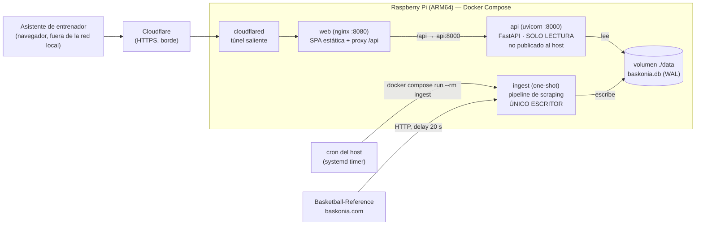

# Deployment: puesta en marcha del PoC (Raspberry Pi + Cloudflare Tunnel)

Documento hermano de [01_design.md](01_design.md) (arquitectura) y
[02_migration.md](02_migration.md) (plan de migración). Aquí se define **cómo se pone en marcha**
la aplicación destino.

## Contexto y objetivo

El README §6.1 ya describe el despliegue vigente del PoC y esa decisión **se mantiene**:

```
[ Colega ] ──HTTPS──▶ [ Cloudflare Tunnel ] ──▶ [ cloudflared (RPi) ] ──▶ [ Streamlit :8501 (RPi) ]
```

- NAS doméstico (Raspberry Pi, ARM64) con Docker.
- `cloudflared` con túnel saliente: HTTPS gratis, sin abrir puertos del router.
- Coste cero, sin proveedor cloud.

Este documento **extiende** ese despliegue de 2 procesos a las 3 aplicaciones del diseño destino,
manteniendo deliberadamente el mismo nivel de sofisticación. Sigue siendo un PoC: el despliegue
profesional (Kubernetes, HA, BD gestionada, SSO, observabilidad) ya está descrito en el README
§6.1 "Despliegue profesional" y **queda fuera de alcance**, igual que hoy.

**Objetivo concreto:** que un asistente de entrenador abra una URL desde fuera de la red local y
vea el dashboard, con los datos refrescados automáticamente por el pipeline, en una Raspberry Pi.

## Alcance

**Entra:** topología de contenedores, imágenes, `docker-compose.yml`, red y exposición, gestión de
la BD SQLite compartida, planificación del pipeline, construcción para ARM64, arranque, operación
del día a día, backups, actualización y rollback.

**Fuera de alcance:** orquestación, alta disponibilidad, autoescalado, PostgreSQL gestionado, SSO,
observabilidad con métricas/trazas, WAF, y CI/CD más allá de lo que ya hay (GitHub Actions
ejecutando pytest) más la construcción de la imagen del frontend.

---

## Diseño

### 1. Topología destino



**Cuatro servicios, tres de ellos permanentes:**

| Servicio | Imagen | Estado | Puerto | Rol |
|---|---|---|---|---|
| `web` | multi-stage: `node:20-alpine` (build) → `nginx:alpine` | permanente | `8080` (solo red interna) | Sirve la SPA y hace de proxy a la API |
| `api` | `python:3.12-slim` | permanente | `8000` (**no publicado**) | FastAPI, solo lectura |
| `ingest` | `python:3.12-slim` | **one-shot** (`restart: no`) | — | Scraping y escritura; lo dispara el cron |
| `tunnel` | `cloudflare/cloudflared:latest` | permanente | — | Expone `web` a internet |

### 2. Tres decisiones de despliegue que simplifican mucho

**(a) Un único origen público → cero CORS.**
`nginx` sirve la SPA y hace de *reverse proxy* de `/api` hacia `api:8000`. Para el navegador, todo
es el mismo origen. Consecuencias: no hay configuración de CORS, no hay *preflight*, no hay
variable `VITE_API_URL` que cambiar entre local y producción (la SPA llama a `/api/v1/...`
relativo), y la API **no se publica al host**: solo es alcanzable desde la red interna de Compose.
Es la simplificación más rentable de todo el despliegue.

**(b) El pipeline es un contenedor de un solo uso, no un servicio.**
No hay un proceso de scraping permanente. El cron del host lanza
`docker compose run --rm ingest`, que corre, escribe y muere. Motivos: el pipeline **es** un
proceso batch; un contenedor que no está en marcha no puede fallar ni consumir memoria en una RPi;
y los logs de cada ejecución quedan asociados a esa ejecución concreta.

**(c) La API no tiene red saliente.**
La imagen de `api` no instala `requests` ni `beautifulsoup4` (requirements separados, ver
[01_design.md](01_design.md) §8). La frontera "solo el pipeline habla con internet" deja de ser una
convención de código y pasa a ser una propiedad del artefacto desplegado.

### 3. La base de datos SQLite compartida

Es el único punto de acoplamiento entre las dos aplicaciones y merece precisión.

- **Un volumen bind-mount único** `./data:/app/data`, montado por `api` (lectura) y por `ingest`
  (escritura). Bind-mount local sobre el sistema de ficheros de la RPi: **nunca sobre NFS ni sobre
  una unidad de red** — SQLite no es seguro ahí, y ese es precisamente uno de los disparadores de
  migración a PostgreSQL del §7 del diseño.
- **WAL activado** (`PRAGMA journal_mode=WAL`) en el `connect` del engine. Con WAL, la API sigue
  sirviendo lecturas mientras el pipeline escribe. Es lo que hace viable un solo escritor + varios
  lectores sin bloqueos.
- **La API abre la BD en modo solo lectura** (`?mode=ro&uri=true` en la URL de conexión). Refuerza
  a nivel de sistema operativo lo que el diseño ya promete.
- **Backup automático antes de cada escritura destructiva**: `main.py:_backup_database()` **ya
  existe** y produce `data/baskonia.db.bak-<timestamp>`. No hace falta añadir nada; sí hace falta
  una tarea de retención (ver §7).
- **La BD no viaja en la imagen.** Si es la primera puesta en marcha, se copia
  `data/baskonia.db` a la RPi (`scp`) o se deja que el primer `ingest` la cree desde cero.

### 4. `docker-compose.yml` (ilustrativo)

```yaml
services:
  api:
    build:
      context: .
      dockerfile: apps/api/Dockerfile
    # Sin "ports": solo alcanzable desde la red interna de Compose (vía nginx).
    volumes:
      - ./data:/app/data:ro          # solo lectura, reforzado por el propio Docker
    environment:
      DATABASE_URL: "sqlite:////app/data/baskonia.db?mode=ro&uri=true"
      LOG_LEVEL: "INFO"
    healthcheck:
      test: ["CMD", "python", "-c",
             "import urllib.request;urllib.request.urlopen('http://localhost:8000/api/v1/health')"]
      interval: 30s
      timeout: 5s
      retries: 3
    restart: unless-stopped

  web:
    build:
      context: .
      dockerfile: apps/web/Dockerfile
    depends_on:
      api:
        condition: service_healthy
    ports:
      - "127.0.0.1:8080:8080"        # solo localhost: el acceso público es por el túnel
    restart: unless-stopped

  tunnel:
    image: cloudflare/cloudflared:latest
    command: tunnel --no-autoupdate run
    environment:
      TUNNEL_TOKEN: "${CLOUDFLARE_TUNNEL_TOKEN}"
    depends_on:
      - web
    restart: unless-stopped

  ingest:
    build:
      context: .
      dockerfile: apps/ingest/Dockerfile
    volumes:
      - ./data:/app/data             # lectura y escritura: único escritor del sistema
    env_file: .env                   # USER_AGENT, REQUEST_DELAY, TEAMS, SEASON, LEAGUES...
    profiles: ["manual"]             # no arranca con "up"; se invoca con "run"
    restart: "no"
```

`profiles: ["manual"]` es lo que hace que `docker compose up -d` levante los tres servicios
permanentes y **no** el pipeline. El pipeline se invoca de forma explícita:

```bash
docker compose run --rm ingest                     # ejecución normal
docker compose run --rm ingest --refresh-teams     # refrescar plantillas
docker compose run --rm ingest --fix-league        # backfill de competición (hace backup previo)
```

### 5. `nginx.conf` del servicio `web` (ilustrativo)

```nginx
server {
    listen 8080;
    root /usr/share/nginx/html;

    # SPA: cualquier ruta desconocida devuelve index.html (rutas de cliente).
    location / {
        try_files $uri $uri/ /index.html;
    }

    # Los assets con hash en el nombre son inmutables.
    location /assets/ {
        expires 1y;
        add_header Cache-Control "public, immutable";
    }

    # Único origen: la API se sirve bajo el mismo host → sin CORS.
    location /api/ {
        proxy_pass http://api:8000;
        proxy_set_header Host              $host;
        proxy_set_header X-Forwarded-For   $proxy_add_x_forwarded_for;
        proxy_set_header X-Forwarded-Proto $scheme;
        proxy_read_timeout 120s;          # margen para la generación de PDF/PPTX
    }
}
```

### 6. Construcción para ARM64

La Raspberry Pi es ARM64. Dos costes distintos:

- **Imágenes Python**: `pandas`, `numpy` y `SQLAlchemy` tienen *wheels* ARM64 publicadas; se
  construyen en la RPi sin compilar. Ya es el caso hoy (README §6.1 "Notas").
- **Imagen del frontend**: `npm ci && npm run build` en una RPi 4 es lento (varios minutos y
  presión de memoria).

**Recomendación (opción A): construir el frontend en CI y publicar la imagen.**
GitHub Actions ya ejecuta la suite pytest; se le añade un job que construye
`apps/web/Dockerfile` para `linux/arm64` (vía `docker/build-push-action` + QEMU) y la publica en
GHCR. En la RPi, `web` deja de tener `build:` y pasa a `image: ghcr.io/<org>/baskonia-web:<tag>`.
Actualizar es `docker compose pull && docker compose up -d`, que en una RPi es cuestión de
segundos.

**Alternativa (opción B): construir en la propia RPi.**
Válida y más simple de montar (no hace falta CI ni registro), pero cada despliegue del frontend
cuesta minutos. Aceptable si los cambios de frontend son poco frecuentes. Es el camino a seguir si
no se quiere depender de GitHub Actions.

En ambos casos el `Dockerfile` del frontend es el mismo multi-stage:

```dockerfile
# apps/web/Dockerfile (ilustrativo)
FROM node:20-alpine AS build
WORKDIR /src
COPY apps/web/package*.json ./
RUN npm ci
COPY apps/web/ ./
RUN npm run build

FROM nginx:alpine
COPY apps/web/nginx.conf /etc/nginx/conf.d/default.conf
COPY --from=build /src/dist /usr/share/nginx/html
EXPOSE 8080
```

### 7. Planificación del pipeline

El README ya señala que hay que ejecutar el pipeline periódicamente para que la UI muestre datos al
día. Con el despliegue destino, eso es un `systemd timer` en el host (preferible a `cron` por sus
logs en `journalctl`):

```ini
# /etc/systemd/system/baskonia-ingest.service
[Unit]
Description=Baskonia — pipeline de captura (one-shot)
After=docker.service
Requires=docker.service

[Service]
Type=oneshot
WorkingDirectory=/opt/baskonia-pipeline
ExecStart=/usr/bin/docker compose run --rm ingest
```

```ini
# /etc/systemd/system/baskonia-ingest.timer
[Unit]
Description=Ejecuta el pipeline de captura cada noche

[Timer]
OnCalendar=*-*-* 04:30:00
Persistent=true            # recupera la ejecución si la RPi estaba apagada

[Install]
WantedBy=timers.target
```

```bash
sudo systemctl daemon-reload
sudo systemctl enable --now baskonia-ingest.timer
systemctl list-timers baskonia-ingest.timer     # comprobar próxima ejecución
```

**Horario nocturno a propósito**, por dos razones concretas: el `REQUEST_DELAY = 20 s` hace que una
ejecución completa dure bastante, y así la ventana de escritura no coincide con el uso real de la
herramienta.

**Retención de backups.** `_backup_database()` crea un `.bak-<timestamp>` en cada ejecución
destructiva; sin limpieza, la tarjeta SD se llena. Una línea en el mismo `.service`:

```
ExecStartPost=/usr/bin/find /opt/baskonia-pipeline/data -name 'baskonia.db.bak-*' -mtime +14 -delete
```

### 8. Configuración

Un único `.env` en la raíz del despliegue, derivado del `.env.example` ya existente:

| Variable | Consumidor | Notas |
|---|---|---|
| `DATABASE_URL` | api, ingest | `sqlite:////app/data/baskonia.db` (ingest) / `...?mode=ro&uri=true` (api) |
| `USER_AGENT`, `REQUEST_DELAY`, `TIMEOUT`, `MAX_RETRIES` | ingest | **no** las lee la API |
| `SEASON`, `TEAMS`, `LEAGUES`, `LAST_N_GAMES` | ingest | selección de qué se scrapea |
| `LOG_LEVEL` | api, ingest | defecto `INFO` |
| `CLOUDFLARE_TUNNEL_TOKEN` | tunnel | **secreto**; `.env` fuera de git (ya cubierto por `.gitignore`) |

### 9. Puesta en marcha desde cero

```bash
# 1. Código en la RPi
cd /opt
git clone <repo> baskonia-pipeline && cd baskonia-pipeline
cp .env.example .env && nano .env          # ajustar + pegar CLOUDFLARE_TUNNEL_TOKEN

# 2. Datos (si ya existe una BD poblada en la máquina de desarrollo)
scp data/baskonia.db pi@raspberrypi:/opt/baskonia-pipeline/data/

# 3. Levantar los servicios permanentes (el pipeline NO arranca aquí)
docker compose up -d --build

# 4. Comprobaciones de humo
curl -s http://127.0.0.1:8080/api/v1/health                  # {"status":"ok"}
curl -s http://127.0.0.1:8080/api/v1/meta/data-freshness     # recuentos y fecha del último partido
curl -s -o /dev/null -w '%{http_code}\n' http://127.0.0.1:8080/   # 200 → la SPA se sirve

# 5. Primera captura (si la BD venía vacía)
docker compose run --rm ingest

# 6. Programar la captura periódica
sudo systemctl enable --now baskonia-ingest.timer
```

**Túnel Cloudflare.** Se recomienda un **túnel con nombre** (no `--url` efímero): la URL
`trycloudflare.com` cambia en cada reinicio, lo que obliga a reenviar el enlace al colega cada vez.
Con un túnel con nombre se obtiene un token que se pega en `.env` y una URL estable:

```bash
cloudflared tunnel login
cloudflared tunnel create baskonia
cloudflared tunnel route dns baskonia baskonia.<tu-dominio>
# El token del túnel se copia al .env como CLOUDFLARE_TUNNEL_TOKEN
```

Sin dominio propio, la opción `--url http://web:8080` del README sigue siendo válida para una demo
puntual, asumiendo URL cambiante.

### 10. Operación del día a día

| Tarea | Comando |
|---|---|
| Ver estado | `docker compose ps` |
| Logs de la API | `docker compose logs -f api` |
| Logs del último scraping | `journalctl -u baskonia-ingest.service -n 200` |
| Captura manual inmediata | `docker compose run --rm ingest` |
| Scouting de un rival concreto | `docker compose run --rm ingest --refresh-teams` |
| Reiniciar la UI | `docker compose restart web` |
| Actualizar código | `git pull && docker compose up -d --build` (u opción A: `docker compose pull && up -d`) |
| Backup manual de la BD | `cp data/baskonia.db data/baskonia.db.bak-$(date +%s)` |
| Verificar calidad del dato | `curl -s http://127.0.0.1:8080/api/v1/admin/data-quality` (= `insights.validate_data`) |

**Rollback de un despliegue:** `git checkout <tag-anterior> && docker compose up -d --build`. Las
imágenes son sin estado; el único estado es `data/baskonia.db`, que no cambia al revertir código.
Si un `ingest` corrompiera datos, se restaura el `.bak-<timestamp>` inmediatamente anterior.

### 11. Seguridad del PoC (y sus límites, explícitos)

Lo que **sí** hay:

- HTTPS de extremo a extremo hasta Cloudflare; sin puertos abiertos en el router (túnel saliente).
- La API no se publica al host: solo alcanzable por `nginx` dentro de la red de Compose.
- `web` publicado únicamente en `127.0.0.1:8080`, no en `0.0.0.0`.
- Volumen de datos montado `:ro` en la API.
- La API no puede hacer peticiones salientes (sin librería HTTP instalada).
- Secretos en `.env`, fuera de git.

Lo que **no** hay, y se asume conscientemente por ser un PoC:

- **Sin autenticación.** Quien tenga la URL, entra. Mitigación de coste casi nulo si hace falta:
  **Cloudflare Access** delante del túnel (plan gratuito hasta 50 usuarios), que añade login por
  correo sin tocar una línea de código de la aplicación. Es la primera medida a activar si el
  enlace pasa de un colega a un grupo.
- Sin rate limiting propio (Cloudflare aporta el del borde).
- Sin cifrado en reposo de la BD.
- Sin gestor de secretos.

### 12. Recursos en la Raspberry Pi

| Servicio | Memoria estimada | Notas |
|---|---|---|
| `api` (uvicorn) | ~150-250 MB | pandas cargado; una única réplica |
| `web` (nginx) | ~10 MB | sirve ficheros estáticos |
| `tunnel` | ~30 MB | — |
| `ingest` | ~200 MB, **solo durante la ejecución** | one-shot nocturno |

Total en régimen permanente: **< 300 MB**. Cabe con holgura en una RPi 4 de 2 GB. La comparación
con el despliegue actual es favorable: hoy Streamlit mantiene una sesión de servidor por usuario
conectado y recalcula en cada interacción; con la API, N usuarios comparten respuestas cacheadas
(`Cache-Control` + `ETag`, ver [01_design.md](01_design.md) §4).

---

## Criterios de aceptación

1. **Arranque limpio**: sobre una RPi con Docker y el repo recién clonado,
   `docker compose up -d --build` deja `api`, `web` y `tunnel` en estado `running`/`healthy`, y
   **no** arranca `ingest`.
2. **Humo de la API**: `GET /api/v1/health` devuelve `200` y `GET /api/v1/meta/data-freshness`
   devuelve recuentos coherentes con la BD montada.
3. **Un solo origen**: la SPA cargada desde la URL pública hace todas sus llamadas a rutas `/api/`
   del mismo host; el navegador no registra ninguna petición *preflight* CORS.
4. **API no expuesta**: `curl http://<ip-rpi>:8000/` desde otra máquina de la LAN falla
   (conexión rechazada); solo `web` responde, y solo en `127.0.0.1`.
5. **Aislamiento de escritura**: con `ingest` parado, la SPA funciona por completo. Con `api`
   parado, `docker compose run --rm ingest` completa su ejecución sin error.
6. **Concurrencia real**: durante una ejecución de `ingest`, la SPA sigue respondiendo (verifica
   que WAL está activo y que no hay `database is locked`).
7. **Frescura del dato**: tras una ejecución del pipeline, `meta/data-freshness` refleja el nuevo
   recuento sin reiniciar ningún contenedor.
8. **Periodicidad**: `systemctl list-timers` muestra `baskonia-ingest.timer` activo, y tras la
   primera ejecución programada `journalctl -u baskonia-ingest.service` contiene el resumen de la
   ejecución.
9. **Backups acotados**: existen `.bak-*` recientes en `data/` y ninguno con más de 14 días.
10. **Actualización sin pérdida de datos**: `git pull && docker compose up -d --build` deja la BD
    intacta (mismo recuento de filas en las 5 tablas antes y después).
11. **Rollback**: volver a la etiqueta anterior y reconstruir deja el sistema funcional en menos de
    5 minutos.
12. **Acceso externo**: la URL pública del túnel abre la SPA desde una red distinta a la de la RPi,
    con certificado válido.

## Supuestos y riesgos

| # | Supuesto / riesgo | Mitigación |
|---|---|---|
| 1 | El volumen `./data` está en el sistema de ficheros local de la RPi, no en NFS | Documentado como requisito duro. Sobre NFS, SQLite puede corromperse; sería el disparador de migrar a PostgreSQL ([01_design.md](01_design.md) §7) |
| 2 | Construir el frontend en la RPi es lento y puede agotar memoria | Opción A (construir en CI, publicar a GHCR, la RPi solo hace `pull`). Opción B disponible si no se quiere CI |
| 3 | Tarjeta SD: escrituras del pipeline + backups + logs de Docker | Retención de 14 días para los `.bak`; `log-driver` de Docker con `max-size`/`max-file`. Un SSD USB es la mejora natural si el PoC se alarga |
| 4 | El túnel `trycloudflare.com` cambia de URL en cada reinicio | Túnel con nombre + registro DNS. Recomendado desde el principio |
| 5 | La app queda pública sin autenticación | Cloudflare Access delante del túnel: coste cero, sin cambios de código. Activar en cuanto el enlace se comparta más allá de una persona |
| 6 | Una ejecución del pipeline que falle a medias deja datos parciales | Los upserts ya son idempotentes (verificado por `tests/test_storage.py`); la siguiente ejecución completa lo que falte. Además hay backup previo en las operaciones destructivas |
| 7 | Reinicio de la RPi: los servicios deben volver solos | `restart: unless-stopped` en los tres permanentes + `Persistent=true` en el timer, que recupera la ejecución perdida |
| 8 | `docker compose run` deja contenedores huérfanos si el proceso se interrumpe | `--rm` en todas las invocaciones + `docker compose run --rm` en el `.service` |
| 9 | La generación de PDF/PPTX es la operación más pesada de la API en ARM | `proxy_read_timeout 120s` en nginx; si se queda corto, el siguiente paso es generar el informe de forma asíncrona (fuera de alcance del PoC) |
| 10 | Sin métricas ni alertas: un fallo del cron pasa desapercibido | `meta/data-freshness` es visible en la propia UI: un dato viejo se ve a simple vista. Es la señal de salud adecuada al nivel del PoC |

## Preguntas abiertas para el usuario

1. **¿Hay dominio propio disponible en Cloudflare?** Determina si el túnel puede tener nombre y URL
   estable (recomendado) o queda en `trycloudflare.com` efímero.
2. **¿Se activa Cloudflare Access desde el principio?** Recomendación: **sí** en cuanto el enlace se
   comparta con más de una persona. Coste cero y sin cambios de código.
3. **¿Opción A (construir en CI + GHCR) u opción B (construir en la RPi)?** Recomendación: A si ya
   se usa GitHub Actions para los tests — que es el caso; B si se prefiere no depender de un
   registro externo.
4. **Frecuencia del pipeline.** Se propone una ejecución nocturna diaria. Si la preparación de
   partidos exige datos del mismo día tras un partido de tarde, una segunda ejecución (p.ej. a las
   23:30) es un cambio de una línea en el `OnCalendar`.
