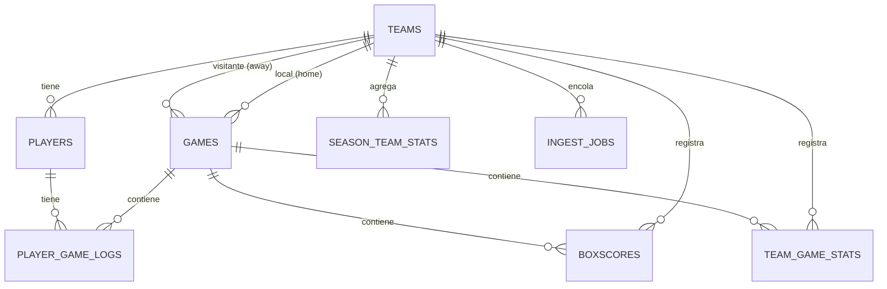
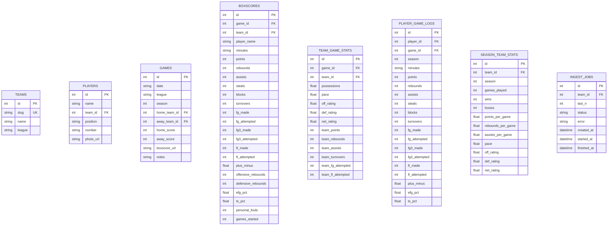

# Mapa de la Base de Datos — baskonia-pipeline

> **Fecha:** 2026-08-20
> **Fuente:** `data/baskonia.db` (SQLite) + `packages/baskonia_core/db/models.py` + migraciones Alembic
> **Estado:** Análisis de salud y propuesta de mejora
>
> ⚠️ **Nota (feature 012, `api-nuevo-modelo-datos`, 2026-08-21):** este análisis describe el
> esquema **antiguo** de BBR (`packages/baskonia_core/db/models.py`: `teams.slug`, `boxscores`,
> `team_game_stats` con `off_rating`/`def_rating`, `ingest_jobs`). El esquema real de
> `data/baskonia.db` es ahora el de **scouting** (`packages/baskonia_core/db/scouting/schema.sql`:
> PKs TEXT `'bas'`/`'g1'`/`'acb-105370'`, tablas `seasons`/`competitions`/`game_advanced_stats`/
> `player_game_stats`/`lineups`/`shots`/`upcoming_matchups`…). Este documento queda como registro
> histórico del análisis sobre el modelo anterior.

---

## 1. Diagrama ER (esquema actual)

### 1.1 Relaciones entre tablas

### 1.2 Atributos por tabla

---

## 2. Estado actual (volumen de datos)

| Tabla | Filas | Rol |
|-------|------:|-----|
| `teams` | 56 | Catálogo de equipos |
| `players` | 193 | Catálogo de jugadores |
| `games` | 328 | Partidos |
| `boxscores` | 963 | Estadísticas jugador/partido |
| `team_game_stats` | 82 | Estadísticas avanzadas equipo/partido |
| `player_game_logs` | **0** | Game log jugador/partido (vacía) |
| `season_team_stats` | **0** | Agregados equipo/temporada (vacía) |
| `ingest_jobs` | 0 | Cola de trabajos de scouting (vacía) |

**Tamaño del fichero:** ~228 KB.

---

## 3. Problemas detectados (por qué "se nos está yendo de madre")

### 🔴 Críticos

1. **`boxscores.player_name` es un string, no una FK a `players`.**
   - `boxscores` guarda `player_name` como texto libre en lugar de `player_id`.
   - **101 de 278** nombres distintos en `boxscores` **no existen** en `players`.
   - Resultado: **duplicación de datos** y **sin integridad referencial**. Un mismo jugador puede aparecer con nombres ligeramente distintos ("Daniel Perez" vs "Daniel Perez" con acentos, "David Duke Jr.", etc.) y no hay forma de unirlos de forma fiable.
   - `player_game_logs` sí usa `player_id` (FK correcta), pero `boxscores` no → **dos modelos de datos inconsistentes** para lo mismo.

2. **`games.season` está vacío en el 100% de las filas (328/328).**
   - La columna existe pero nunca se rellena. Sin temporada, no se pueden hacer agregados por temporada ni filtrar correctamente.

3. **`player_game_logs` y `season_team_stats` están vacías (0 filas).**
   - Son las tablas que dan soporte a los agregados de temporada y evolución de jugador. Están definidas en el modelo y en las migraciones, pero el pipeline actual (backfill con BBR) **no las puebla** — solo el scraper de RealGM las rellena, y el último backfill usó BBR.

### 🟠 Importantes

4. **`teams.league` está mal: todos los equipos están marcados como `'acb'`.**
   - Hay 56 equipos `acb`, pero `games.league` tiene 4 valores: `acb` (175), `euroleague` (118), `gre` (34), `supercopa` (1).
   - Equipos claramente de EuroLeague/Griega (Olympiacos, Panathinaikos, Real Madrid, Barcelona, Maccabi, Bayern, etc.) están etiquetados como `acb`. **La liga del equipo no coincide con la liga del partido.**

5. **Duplicados de equipos por nombre (misma entidad, filas distintas).**
   - "Bayern Munich" y "Bayern München" (2 filas).
   - "Virtus Bolonia" y "Virtus Olidata Bologna" (2 filas).
   - "Hapoel IBI Tel Aviv" y "Hapoel Tel Aviv" (2 filas).
   - "Maccabi Rapyd Tel Aviv" y "Maccabi Tel Aviv" (2 filas).
   - "Olimpia Milano" y "EA7 Emporio Armani Milano" (2 filas).
   - "Crvena zvezda Meridianbet" y "KK Crvena Zvezda" (2 filas).
   - Esto fragmenta el catálogo y rompe los agregados por equipo.

6. **Cobertura de boxscores muy baja.**
   - 244 games tienen `boxscore_url`, pero solo **41 games** tienen `boxscores` y `team_game_stats`.
   - Es decir, **203 partidos con URL de boxscore pero sin estadísticas descargadas** (descarga pendiente o fallida).

### 🟡 Menores

7. **`games.date` es un string con formato humano** ("Fri, May 29, 2026") en lugar de una fecha ISO/`DATE`. Dificulta ordenar, filtrar por rango y comparar.

8. **Sin índices explícitos** (solo los implícitos de PK/UK). Con el volumen actual no es crítico, pero al crecer las consultas por `game_id`/`team_id`/`player_id` se degradarán.

9. **`boxscores` y `player_game_logs` solapan funcionalidad** (mismas columnas de stats). Hay que decidir cuál es la fuente de verdad.

---

## 4. Propuesta de mejora (hoja de ruta)

### Fase A — Normalizar el modelo de jugador (crítico)
- Añadir `player_id` (FK a `players`) a `boxscores`, manteniendo `player_name` como denormalización de lectura.
- Crear un proceso de **deduplicación de jugadores** (normalizar nombres: acentos, "Jr.", sufijos) y re-apuntar los `boxscores` existentes.
- Unificar `boxscores` y `player_game_logs` en un único modelo de stats por jugador/partido (o definir claramente cuál es la fuente de verdad).

### Fase B — Corregir el catálogo de equipos
- **Deduplicar equipos** (merge de "Bayern Munich"/"Bayern München", etc.).
- **Corregir `teams.league`** para que refleje la liga real de cada equipo (o eliminar la columna y derivarla de `games.league`).

### Fase C — Rellenar datos faltantes
- **Backfill de `games.season`** a partir de la fecha.
- **Poblar `player_game_logs` y `season_team_stats`** (el scraper de RealGM ya está arreglado y puede hacerlo).
- **Completar los 203 boxscores pendientes** (games con URL pero sin stats).

### Fase D — Higiene de esquema
- Migrar `games.date` a tipo fecha real (ISO).
- Añadir índices sobre las FKs más consultadas (`boxscores.game_id`, `boxscores.team_id`, `player_game_logs.player_id`, etc.).
- Aplicar todo mediante **migraciones Alembic** (no con `_add_missing_columns` ad-hoc).

---

## 5. Resumen ejecutivo

La BD **no está rota** (integridad referencial básica OK: no hay huérfanos en FKs), pero tiene **deuda de diseño** que ya está mordiendo:

- El **modelo de jugador está duplicado** (`boxscores.player_name` vs `players`), lo que impide análisis fiables por jugador.
- El **catálogo de equipos está fragmentado y mal etiquetado** por liga.
- Las **tablas de agregados de temporada están vacías** y `season` sin rellenar, así que el "scouting de temporada" no tiene datos con los que trabajar.

**Prioridad:** Fase A (normalizar jugador) → Fase B (equipos) → Fase C (rellenar) → Fase D (higiene).
